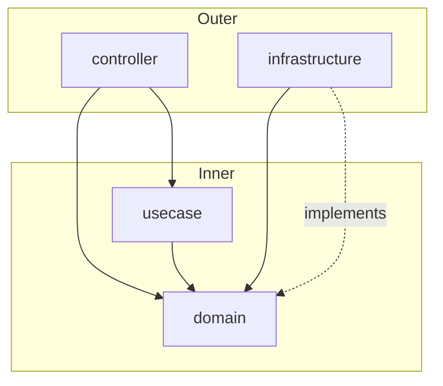

# Java Clean Architecture Template (Spring Boot 4)

A production-grade **Spring Boot 4 / Java 21** Clean Architecture template with **enforced layer boundaries**, **multi-tenant data**, **transactional outbox → Kafka**, a full local stack, BDD + Testcontainers, security and quality gates, and first-class AI-agent docs—ready to fork, not a toy sample.

Maintained by [OLX India](https://github.com/olx-india) · [Apache License 2.0](LICENSE)

[](https://docs.oracle.com/en/java/javase/21/)
[](https://spring.io/projects/spring-boot)
[](https://maven.apache.org/)
[](https://opensource.org/licenses/Apache-2.0)
[](https://github.com/olx-india/java-service-template-clean-architecture/actions/workflows/package-verify.yml)

---

## Why this template

**Who it's for:** teams bootstrapping a new Java microservice that need Clean Architecture with production patterns (tenancy, events, cache, observability)—not a minimal hexagonal skeleton.

What sets it apart from typical starters:

- **ArchUnit-enforced Clean Architecture** — domain and use cases cannot depend on infrastructure; violations fail the build
- **Database-per-tenant MySQL** — with read/write replica routing
- **Transactional outbox → Kafka** — events written atomically with business data, then relayed; see [docs/outbox-pattern.md](docs/outbox-pattern.md)
- **Production-shaped tests** — Cucumber BDD + Testcontainers (MySQL, Redis, Kafka); no private dependencies
- **Ops-ready defaults** — Resilience4j, optional JWT, Prometheus, OpenTelemetry, SpotBugs, OWASP dependency-check
- **AI-agent DX** — [AGENTS.md](AGENTS.md) and [docs/ai-agents.md](docs/ai-agents.md) for Cursor / Claude Code



---

## Quick start

```bash
git clone https://github.com/olx-india/java-service-template-clean-architecture.git
cd java-service-template-clean-architecture

export JAVA_HOME=$(/usr/libexec/java_home -v 21)   # macOS
cp .env.example .env                                # optional

make dev
```

`make dev` loads `.env`, starts Docker infrastructure (MySQL, Redis, Kafka), runs Flyway migrations, and starts the Spring Boot server.

**Prerequisites:** JDK 21, Docker & Docker Compose, Git. Make is optional but recommended.

**Manual steps** (if you prefer):

```bash
make docker-up
make migrate
make run
```

| | URL |
|--|-----|
| API | http://localhost:8080 |
| Swagger UI | http://localhost:8080/swagger-ui/index.html |
| Actuator (metrics) | http://localhost:8081/metrics |

Use the `X-Default-Tenant: default` header on API requests.

More detail: [docs/local-setup.md](docs/local-setup.md)

---

## What's included

| Area | Capabilities |
|------|----------------|
| **Architecture** | Clean Architecture layers, ArchUnit boundaries, use-case + command pattern |
| **Data** | Multi-tenant MySQL, Flyway, JPA ports/adapters, R/W routing |
| **Messaging** | Transactional outbox, `EventPublisher` port, Kafka relay |
| **Cache** | Redis + Spring Cache, actuator eviction |
| **API** | REST, Bean Validation, SpringDoc OpenAPI, consistent error handling |
| **Ops** | Resilience4j, optional JWT, Prometheus, OTel, health probes, correlation IDs |
| **Quality** | SpotBugs, OWASP dependency-check, JaCoCo, Eclipse formatter |
| **Testing** | JUnit 5, Mockito, Cucumber, Testcontainers, RestAssured |
| **DX** | `make dev`, Docker Compose, `.env.example`, Maven wrapper, AI-agent docs |

Full breakdown: [docs/features.md](docs/features.md)

### Tech stack

| Category | Technology |
|----------|------------|
| Runtime | Java 21 |
| Framework | Spring Boot 4.0.8 |
| Build | Maven 3.6+ (wrapper included) |
| Database | MySQL 8, Flyway |
| Cache | Redis, Spring Cache |
| Messaging | Apache Kafka |
| API docs | SpringDoc OpenAPI |
| Testing | JUnit 5, Mockito, Cucumber, Testcontainers, RestAssured |

---

## Project structure

```
├── src/main/java/com/olx/boilerplate/
│   ├── controller/           # REST API, DTOs
│   ├── usecase/              # Application use cases and commands
│   ├── domain/               # Entities, ports, domain exceptions
│   │   └── repository/       # Repository port interfaces
│   └── infrastructure/       # JPA, Redis, Kafka, config, security
├── src/test/
│   ├── java/.../ut/          # Unit tests + ArchUnit
│   └── java/.../it/          # Cucumber + Testcontainers integration tests
├── docs/                     # Architecture, features, setup, runbook
├── docker-compose-local.yml  # MySQL, Redis, Kafka, OTel collector
├── Makefile                  # build, test, dev, migrate
└── pom.xml
```

| Layer | Responsibility |
|-------|----------------|
| **Controller** | HTTP, validation, DTO ↔ command mapping |
| **Use case** | Application workflows |
| **Domain** | Entities, ports, business rules |
| **Infrastructure** | Adapters and framework wiring |

Deep dive: [docs/clean-architecture.md](docs/clean-architecture.md) · [docs/low-level-design.md](docs/low-level-design.md)

---

## Commands

```bash
make dev               # Load .env, start infra, migrate, run server
make build             # Package (skip integration tests)
make test              # Unit tests
make it                # Cucumber IT (≈ CI integration-tests job; needs Docker)
make verify            # Unit + SpotBugs + formatter + JaCoCo (≈ CI verify job; skips OWASP)
make verify-all        # Full verify including OWASP (slow; also weekly CI)
make spotbugs          # SpotBugs only
make dependency-check  # OWASP only
make security          # SpotBugs + OWASP
make docker-up         # Start infrastructure containers only
make docker-down       # Stop containers
make migrate           # Run Flyway migrations (loads .env)
make run               # Start Spring Boot (infra must already be up)
make format            # Apply Eclipse formatter
```

**Local Docker:** `make docker-up` starts MySQL, Redis, Kafka, and the OTel collector only. Run the app with `make run` or `make dev`. Do not start a packaged `myapp` container for day-to-day local development.

**Configuration:** profiles `local` and `integration-test` in `application*.yaml`. Copy [`.env.example`](.env.example) for `DB_HOST`, `REDIS_HOST`, `KAFKA_HOST`, `SCHEMAS_TO_MIGRATE`, etc. Optional auth: `spring.security.enabled=true` with `security.mode=hmac` (JWT secret) or `security.mode=oidc` (`OAUTH2_JWK_SET_URI`).

**CI:** two stages — `verify` (`mvn verify -DskipIntegration=true`) and separate `integration-tests` (`make it`).

---

## Customize for your service

1. Run `./scripts/rename-template.sh com.acme.myservice myservice MyServiceApplication` (or rename package/artifact manually in `pom.xml`).
2. Add a domain entity and repository port under `domain/`
3. Add a command + use case under `usecase/`
4. Add request/response DTOs and a controller under `/api/v1/...`
5. Implement the repository adapter in `infrastructure/data/repository/`
6. Add unit tests and a Cucumber scenario

API calls need the `X-Default-Tenant: default` header. Sample APIs: `/api/v1/users`, `/api/v1/orders`.

---

## Documentation

| Topic | Link |
|-------|------|
| Local setup | [docs/local-setup.md](docs/local-setup.md) |
| Features | [docs/features.md](docs/features.md) |
| Clean architecture | [docs/clean-architecture.md](docs/clean-architecture.md) |
| ADRs | [docs/adr/](docs/adr/README.md) |
| Transactional outbox | [docs/outbox-pattern.md](docs/outbox-pattern.md) |
| AI agents (Cursor / Claude) | [AGENTS.md](AGENTS.md) · [docs/ai-agents.md](docs/ai-agents.md) |
| Low-level design | [docs/low-level-design.md](docs/low-level-design.md) |
| Runbook | [docs/runbook.md](docs/runbook.md) |
| All docs | [docs/README.md](docs/README.md) |

---

## FAQ

### Build fails with Lombok or “Unsupported class file major version”

Use **JDK 21**: `export JAVA_HOME=$(/usr/libexec/java_home -v 21)` and use `./mvnw -s settings.xml` if your global Maven settings point to a private repository.

### Where do I configure the environment?

See [docs/local-setup.md](docs/local-setup.md) and [`.env.example`](.env.example).

---

## Contributing

See [docs/CONTRIBUTING.md](docs/CONTRIBUTING.md), [docs/CODE_OF_CONDUCT.md](docs/CODE_OF_CONDUCT.md), and [docs/SECURITY.md](docs/SECURITY.md).

Template change history (by date): [CHANGELOG.md](CHANGELOG.md)

---

## License

Apache License 2.0 — see [LICENSE](LICENSE).
